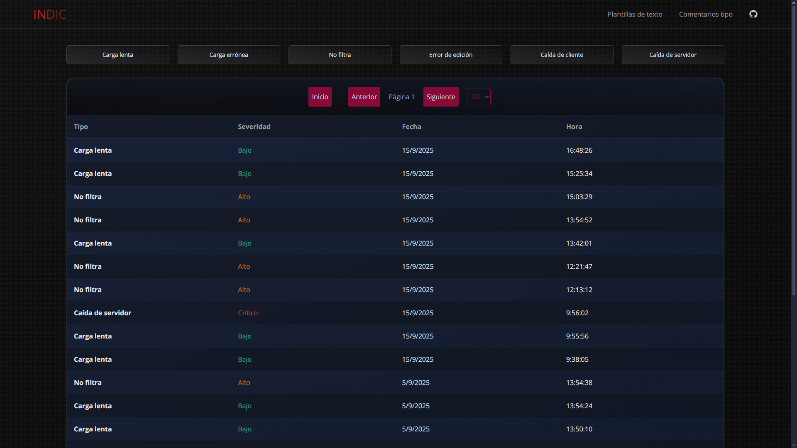

# Indic Down

Proyecto dedicado al seguimiento del estado de la herramienta *Indic* de [*pdc.xaliga.cat*](https://pedc.xaliga.cat) mediante la notificación por parte de los usuarios. Este proyecto permite registrar las caídas del sistema para llevar un histórico visual y cuantificable.

## Tech Stack

| Área                  | Stack                                 |
| -----                 | -----------                           |
| Backend               |    |
| Frontend              |    **SWR** |
| Control de versiones  |   |
| Herramientas          | **dotenv**, **CORS**, **concurrently** |
| Hosting (backend)     | **Railway** |
| Hosting (client)      |  |

## Roadmap

- Añadir paginación [X]
- Añadir filtrado:
  - tipo [ ]
  - gravedad
  - fecha [ ]
- Exportar registro:
  - CSV [ ]
  - XLSX [ ]
  - Markdown / Txt [ ]
  - PDF [ ]
- Autenticación [ ]
- Mejoras visuales:
  - Accesibilidad [ ]
  - Mensajes de error [ ]
  - Diseño de logo [ ]
